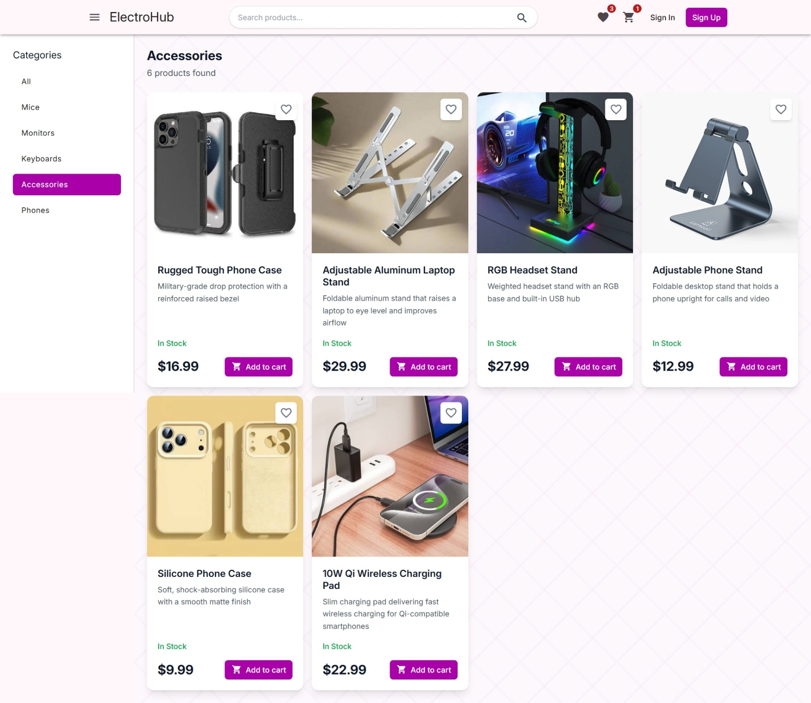
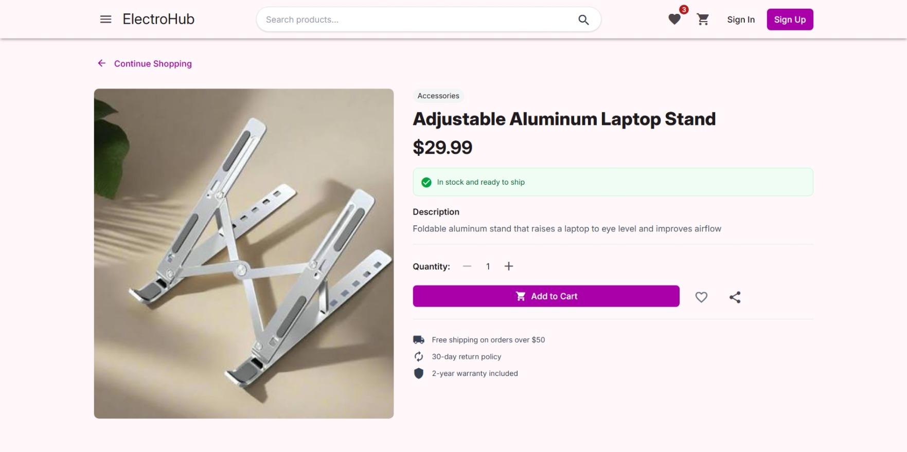
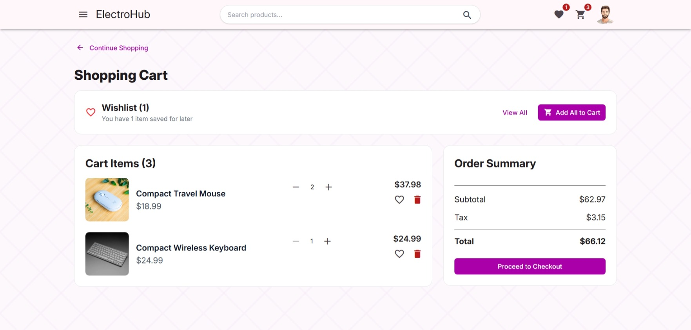
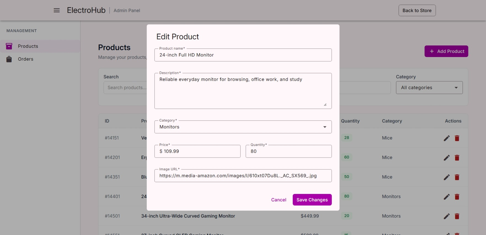

# ElectroHub — E-Commerce Platform Frontend

A modern **e-commerce frontend built with Angular 21**, integrated with a Spring Boot microservices backend.

ElectroHub provides a complete shopping experience for customers, together with an administration panel for managing products and orders.

**Backend:** [ecommerce-platform-backend](https://github.com/nouhaessid/ecommerce-platform-backend)

---

## Screenshots

<p align="center">
  
  
</p>

<p align="center">
  
  
</p>

---

## Demo

A short walkthrough of the ElectroHub application, including authentication, product browsing, cart and checkout, and administration.

[](https://www.youtube.com/watch?v=L8GodrK8Dms)

---

## Features

### Customer Experience

- User registration and authentication
- Customer profile management
- Product browsing and category filtering
- Product search
- Product details
- Shopping cart
- Wishlist
- Checkout
- Order management
- Payment workflow
- Email notifications through the backend

### Administration

- Protected admin area
- Product and category management
- Order management
- Role-based access control

---

## Frontend Architecture

The application follows a component-based Angular architecture with dedicated pages, reusable components, API services, models, authentication, guards, interceptors, and state management.

### State Management

**Angular Signals** and **NgRx Signal Store** are used for reactive application state, while **RxJS** handles asynchronous data streams and API communication.

### Authentication & Authorization

**Keycloak** provides authentication and authorization using **JWT access tokens**.

The frontend uses:

- HTTP interceptors for authenticated API requests
- Route guards for protected pages
- Role-based access for administrative functionality

### Hybrid Rendering

The application uses **Angular Hybrid Rendering** with different rendering strategies depending on the route:

- **Prerendering** for product category pages
- **Server-side rendering (SSR)** for general routes
- **Client-side rendering (CSR)** for highly interactive and authenticated areas such as the cart, wishlist, checkout, order success, and administration panel

---

## UI & Styling

- **Angular Material** — UI components
- **Tailwind CSS** — styling and responsive design
- Reusable Angular components
- Responsive layouts

---

## Technology Stack

| Technology | Purpose |
|---|---|
| Angular 21 | Frontend framework |
| TypeScript | Application development |
| Angular Material | UI components |
| Tailwind CSS | Styling and responsive design |
| Angular Signals | Reactive state |
| NgRx Signal Store | State management |
| RxJS | Asynchronous data handling |
| Angular SSR | Hybrid rendering |
| Keycloak | Authentication and authorization |
| JWT | Access tokens |

---

## Backend Integration

The frontend communicates with the backend through the **API Gateway**.

```text
Angular Frontend
       │
       ▼
   API Gateway
       │
       ├── Customer Service
       ├── Product Service
       └── Order Service
```

For the complete backend architecture, microservices, databases, messaging, and infrastructure details, see the [backend repository](https://github.com/nouhaessid/ecommerce-platform-backend).

---

## Getting Started

### 1. Clone the repository

```bash
git clone https://github.com/nouhaessid/ecommerce-platform-frontend.git
cd ecommerce-platform-frontend
```

### 2. Install dependencies

```bash
npm install
```

### 3. Configure the environment

Update the Angular environment configuration with the backend API URL if necessary.

### 4. Start the application

```bash
ng serve
```

The application will be available at:

```text
http://localhost:4200
```

---

## Future Improvements

* CI/CD pipeline
* Expanded unit and integration testing
* Production deployment
* Further performance and scalability improvements

---

## Related Repository

**Backend:** [ecommerce-platform-backend](https://github.com/nouhaessid/ecommerce-platform-backend)

The frontend and backend repositories together form the complete **ElectroHub e-commerce platform**.
